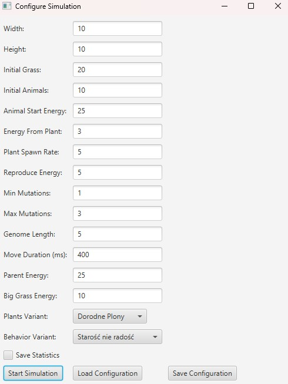
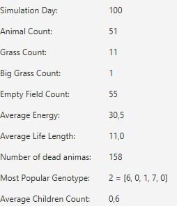
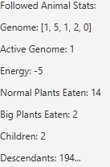
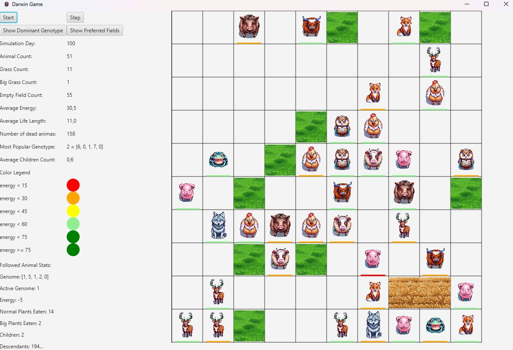

# Darwin World Simulator

**Object-Oriented Programming — Group 4 Project**  
**Authors:** Kajetan Frątczak & Konrad Szymański  
**AGH University of Science and Technology, 2024/25**

An interactive, multi-threaded natural selection simulator written in **Java + JavaFX**.  
Watch hundreds of creatures eat, reproduce, mutate, age, escape fire, and evolve with many simulations running in parallel!


## Features

- Fully object-oriented evolutionary model (genes, mutations, inheritance)
- Multi-threaded run dozens of simulations at once
- Independent pause / resume per simulation
- Real-time detailed statistics (global + per-animal)
- Random deadly fires
- Smooth & responsive JavaFX GUI
- All graphics AI-generated

## Implemented World Variants (G4)

### Globe Map (mandatory)
- Left/right edges wrap around (torus)
- Top/bottom = impassable poles → animals bounce & reverse direction

### Forested Equator (mandatory)
- Plants love the central horizontal belt (tropics vibe)

### Bountiful Crops [G]
- 20% of the map is extra fertile
- Occasionally spawns huge 2×2 plants → massive energy boost
- Conflict resolution same as regular grass

### Old Age Penalty [4] — “Old age is no joy”
- Older animals move slower
- Increasing chance (up to 80%) of skipping a turn while still losing energy

## Screenshots

### Start Configuration


### Global Map Statistics after 100 days


### Selected Animal Statistics


### Simulation in Action


## How to Run

```bash
git clone https://github.com/matwoj8/Darwin_World_Simulation.git
cd Darwin_World_Simulation
./gradlew run


